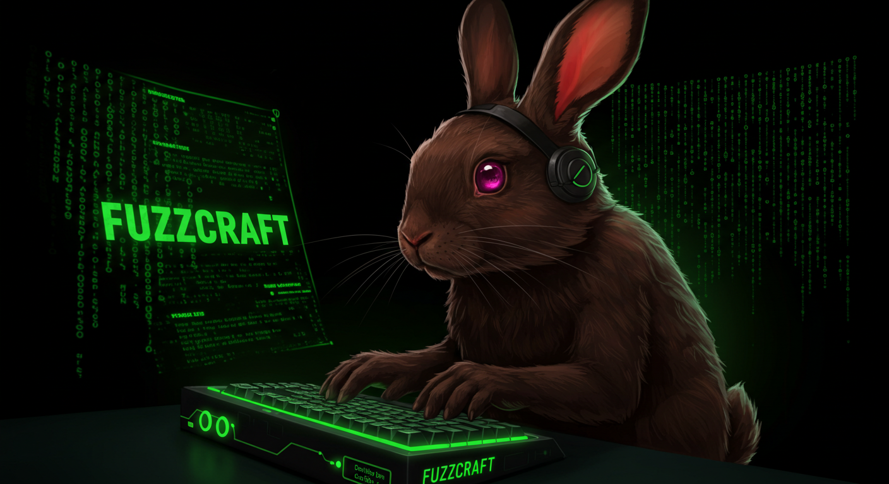

# 🚀 FuzzCraft Bash Helper 💣

<!-- You'll need to create a banner image and put it in an 'assets' folder -->

**Your Interactive Co-Pilot for FFUF Command Line Mastery!**

Tired of fumbling with `ffuf` syntax during intense CTFs or pentests?
FuzzCraft Bash Helper is a colorful, interactive command-line script that guides you through building complex `ffuf` commands, ensuring you get your fuzzing right, *fast*.

<!-- Optional: Add a CI/CD badge if you set one up -->

---

## ✨ Features

*   🎨 **Colorful & Interactive Interface:** Easy-to-follow prompts with ANSI colors.
*   💄 **Enhanced UI with `gum`:** If [gum](https://github.com/charmbracelet/gum) is installed, enjoy beautiful input fields and selection menus! Gracefully falls back if `gum` is not present.
*   🧭 **Guided Command Building:** Step-by-step process for constructing `ffuf` commands.
*   🎯 **Focus on CTF Essentials:** Quickly set up URLs, wordlists, HTTP methods, headers, extensions, status code filtering, and recursion.
*   💡 **Smart Defaults:** Sensible pre-filled values for common options to speed things up.
*   👁️ **Live-ish Command Preview:** See the command take shape as you answer prompts.
*   ✅ **Final Review & Execution:** Confirm the command before running it directly from the script.
*   📋 **Clipboard Integration:** Automatically tries to copy the final command to your clipboard (`xclip` or `pbcopy`).
*   🔧 **Configurable `ffuf` Path:** Easily point to your `ffuf` binary.
*   🚀 **Speed Up Your Workflow:** Spend less time on syntax and more time finding vulns!

---

## 🎬 Demo

*(Consider adding a short GIF or asciinema recording here showing the script in action. This is highly effective!)*

**Without `gum`:**
